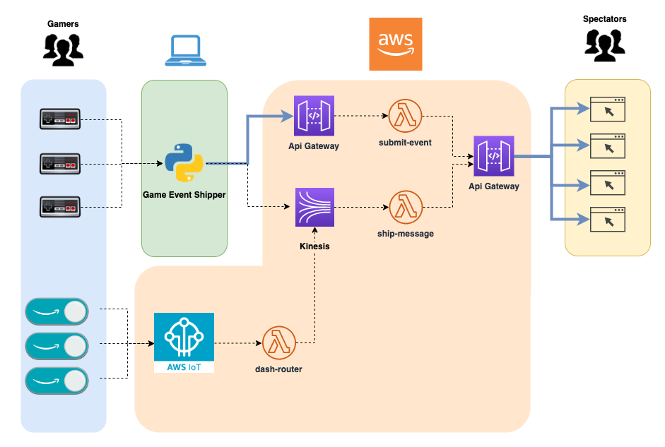
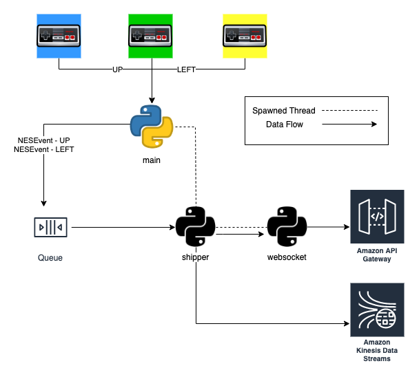

# Tumble Race game

Below is the code required to deploy the demoed Tumble Race Game.

Video presentation + Demo:
- https://www.youtube.com/watch?v=BVpIyN7kWck
- https://www.youtube.com/watch?v=QpcC6Gh8grY

#### Game components:

1. **Event Shipper** - Runs locally on a laptop with connected wireless controllers. This component 
listens for input and shovels input messages in order to an in-memory queue. This queue is pushed over Websocket + to
AWS Kinesis Stream 100 times per second.

1. **Infrastructure** - Deploys the database used to manage connections & authentication
1. **Serverless Webserver** - Websocket based webserver running in AWS Lambda that exposes various routes to support the game.
1. **Race Game UI** - Browser based game that connects via Websocket to the Serverless Webserver and subscribes to relevant
messages that make the game work!

### Game Architecture:

### Event Shipper:

